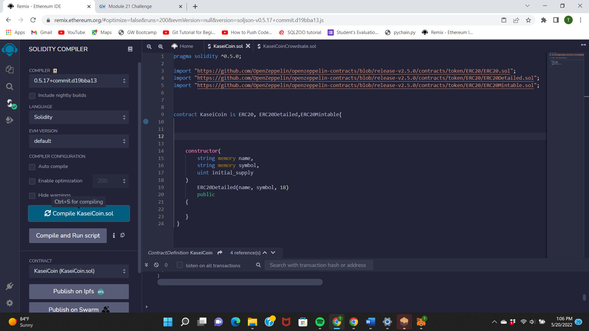
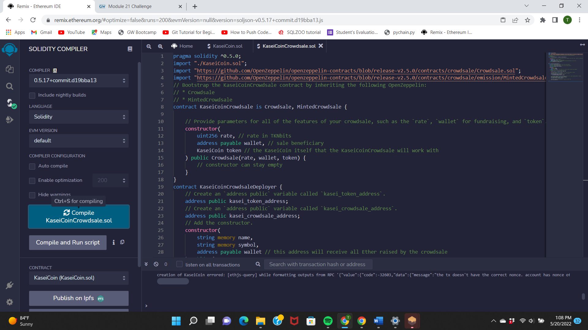
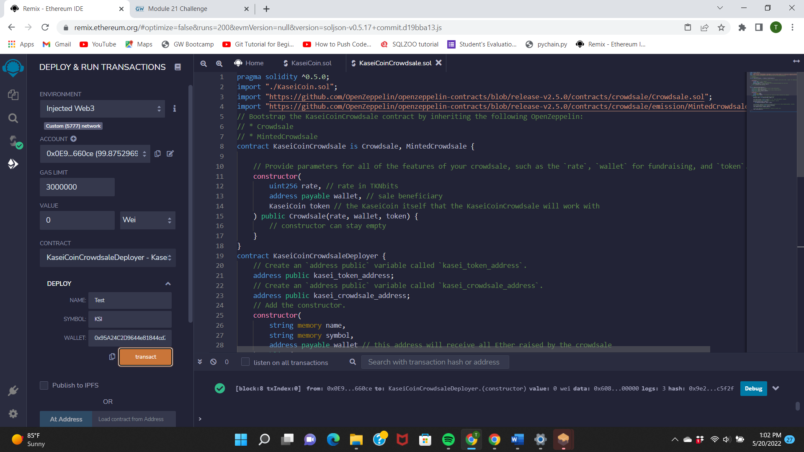
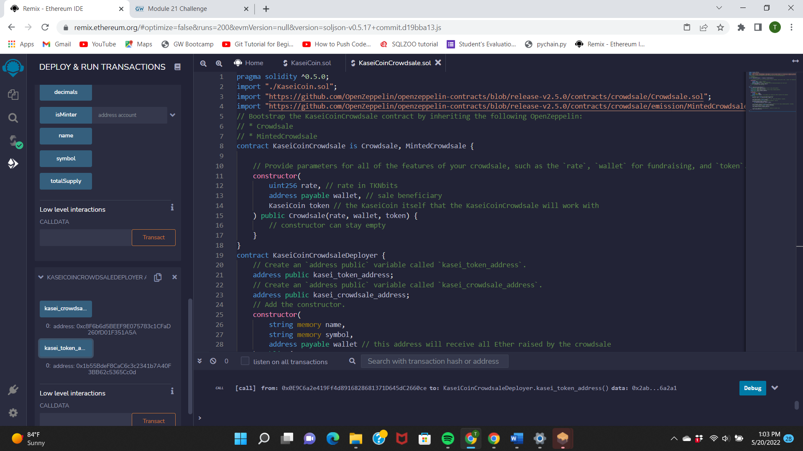
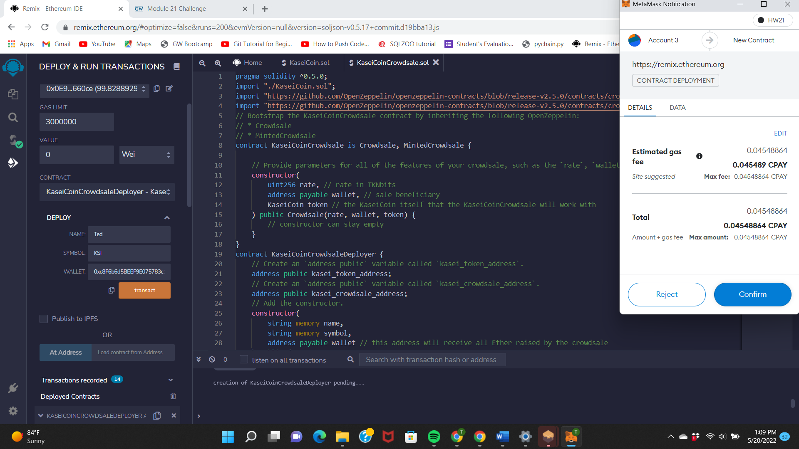
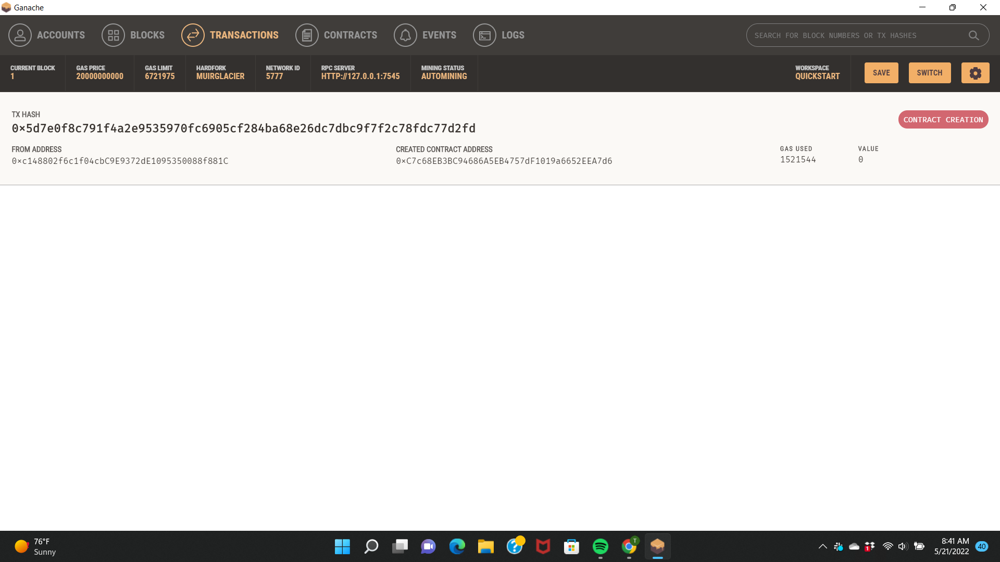

Project Title CrowdSale  Smart Contract

The crowdsale contract that you create will manage the entire crowdsale process, allowing users to send ether to the contract and in return receive KAI, or KaseiCoin tokens. Your contract will mint the tokens automatically and distribute them to buyers in one transaction.

Technologies Remix IDE - pragma solidity ^0.5.0
 OpenZeppelin 

**1 .Create the  token contract.**

**2. Create the crowdsale contract.**

**3. Create the deployer contract.**

**4. Evaluation Evidence**

Kasi Coin Complied 

Crowd sale Compiled 

Deployer Compiled 

Deployed Contract 

Connected to MetaMask and Ganach 

Buy Token 

Purchase Token 

 Contributors

In addtion to me the GW Bootcamp TA, LA, and tutors help me create this project

License

The Source code is for educational purposes only and should not be used to make any professional recomendations. Feel free to use for any educational needs